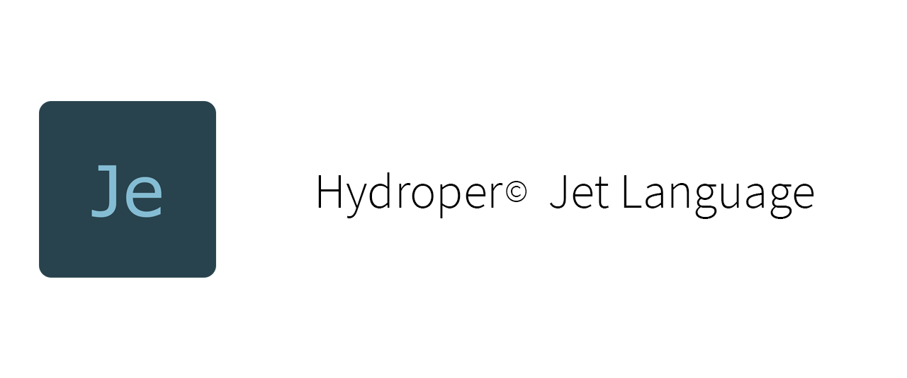
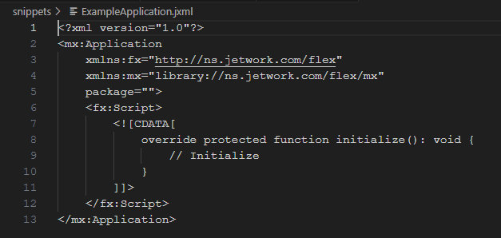

  

  

The Jet language is a flexible scripting language influenced by ActionScript.

> **Note**: Jet is in documentation process and its compiler is not available.

## Interest technologies

| URI | Description |
| --- | ----------- |
| `http://ns.airsdk.dev/2008` | Build applications and games in the mature AIR platform maintained by Samsung HARMAN ([website](https://airsdk.dev)). |
| `http://ns.nodejs.org/2009` | Build processes and command-line applications using Node.js®. |
| `http://ns.unrealengine.com/5` | Build games and simulations using Unreal Engine. |
| `http://ns.w3.org/web` | Build web applications. |

## Language specifications

| Version | Document |
| ------- | -------- |
| 1.0     | [Web](https://hydroper-jet.github.io/lang/spec/1.0/live) |

## Other documents

| Title | Document |
| ----- | -------- |
| Language Design | [GitHub view](design/design.md) |
| Transpilation | [GitHub view](design/transpilation.md) |

## Compiler

The compiler is not available in the present.

## License

Apache License 2.0