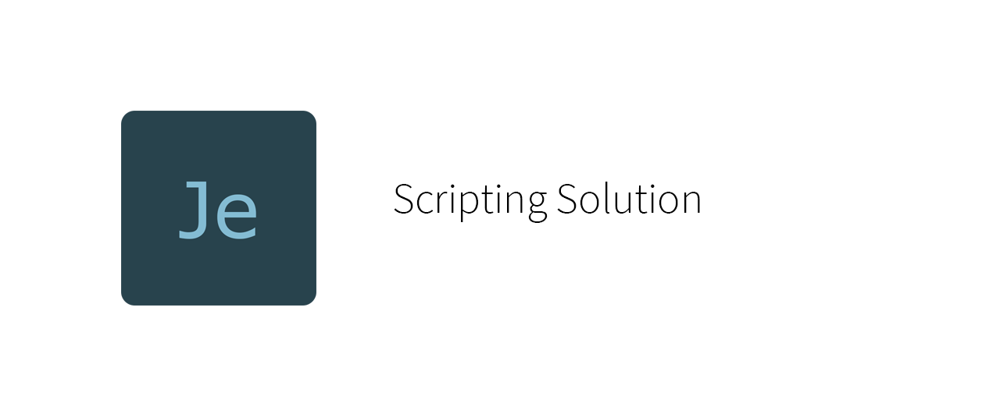
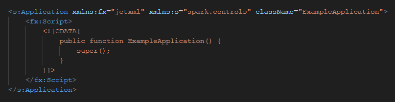

  

  

The JetWork language is a flexible, robust, productive scripting language.

> **Note**: JetWork is in documentation process and its compiler is not available.

## Platform use cases

JetWork may be of interest to the following technologies:

* AIR (`http://www.airsdk.dev/2008`)
* Unreal Engine (`http://www.unrealengine.com/5`)
* LÖVE (`http://www.love2d.org/2018`)
* Godot Engine (`http://www.godotengine.org/4`)

## Language specifications

* [JetWork Language Specification 1.0](spec/spec-1.0.md)

## Design

* [JetWork Language Design](design/design.md)

## Compiler

The compiler is not available in the present.