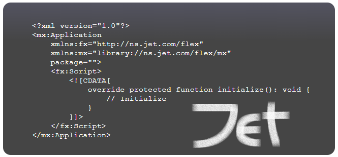

  

The Jet language is a flexible scripting language influenced by ActionScript.

> **Note**: Jet is partially documented and its compiler is being implemented.

## Applicable technologies

Primary plans:

| URI | Description |
| --- | ----------- |
| `http://ns.airsdk.dev/2008` | Build applications and games in the mature AIR platform maintained by Samsung HARMAN ([website](https://airsdk.dev)). |
| `http://ns.nodejs.org/2009` | Build processes and command-line applications using Node.js®. |

Future plans:

| URI | Description |
| --- | ----------- |
| `http://ns.unrealengine.com/5` | Build games and simulations using Unreal Engine. |

## Language specifications

| Version | Document |
| ------- | -------- |
| 1.0     | [Online view](https://hydroper-jet.github.io/lang/spec/1.0/live) |

## Compiler

The compiler is not available in the present.

## License

Apache License 2.0