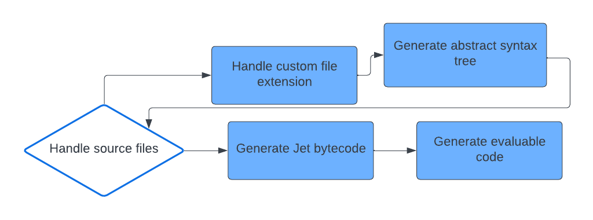

# Compilation

Jet can be compiled to other high-level languages or be executed by a virtual machine.

For Jet support, the JetPM platform must provide its own compiler subset.

## Jet bytecode

The Jet bytecode is undocumented as the Jet compiler is a work in progress and will be similiar to the ActionScript Virtual Machine 2 bytecode format by Adobe.

The Jet bytecode shall support:

* Meta-data with source location attached to definitions
* Meta-data with source location attached to specific code regions of a function as result of annotatated block statements